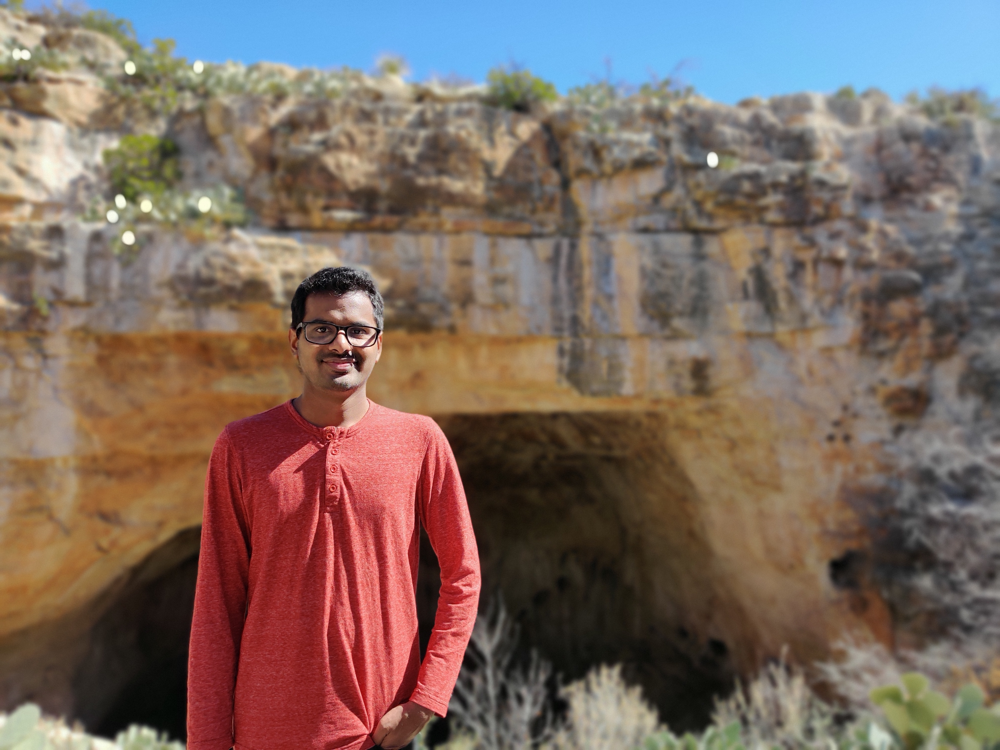

## Rahul Shivaji Pawar 		                          [Publications](Publications.md)		

I am a research scientist at Motorola Solutions. I currently work on problems in speech and audio processing. I am also interested in other areas of machine learning like NLP, generative modeling, and ML theory.

### Publications

1. Audio Diarization for LENA data and its application to computing language behavior statistics for individuals with autism, Ph.D Thesis, Georgia Institute of Technology, 2019.

2. Rebecca M. Jones and Daniela Plesa Skwerer, Rahul Pawar, Amarelle Hamo, Caroline Carberry, Eliana Ajodan,
Desmond Caulley, Melanie Silverman , Shannon McAdoo, Steven Meyer, Anne Yoder , Mark Clements, Catherine
Lord, Helen Tager-Flusberg,“How effective is LENA in detecting speech vocalizations and language produced by
children and adolescents with ASD in different contexts ?”, Autism Research, 2019.

3. Rahul Pawar, A. Albin, U. Gupta, H. Rao, C. Carberry, A. Hamo, R. M. Jones, Catherine Lord, Mark
Clements,“Automatic Analysis of LENA recordings for language assessment in children aged five to fourteen years”,
IEEE BHI, 2017.
